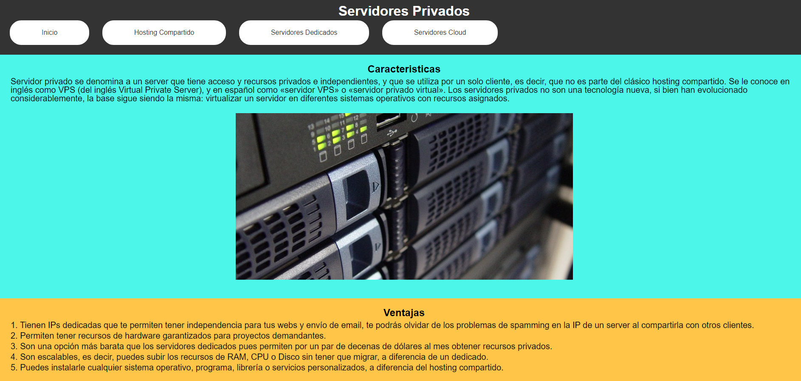
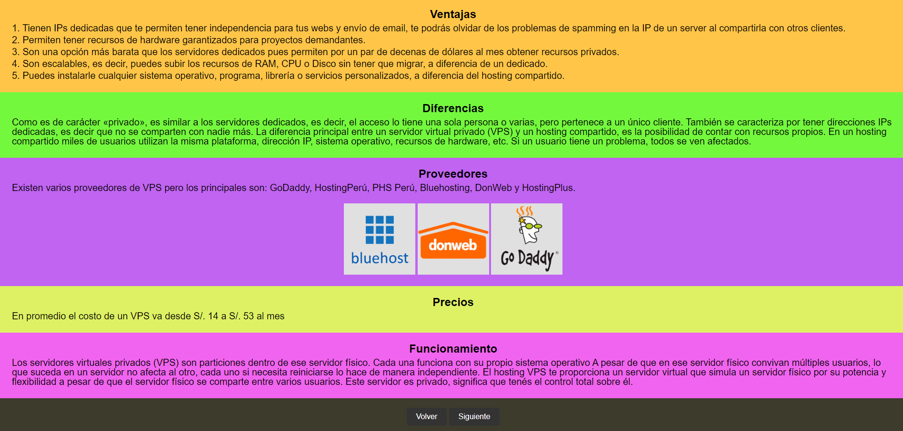

VER: https://fabrizio951.github.io/semana3/index.html

Trabajo realizado por: 

-ADRIANN JOSUE ALVARADO SANCHEZ

-MARICARMEN CATALINA RAYMUNDO ROMERO

-FABRIZIO SANTIAGO ZUNIGA ARIVILCA

-NICOLLE ABRIL PALOMINO QUISPE

El grupo se reparten los temas a cada uno de los integrantes, su investigación y creación de la página. Cada uno tendra que crear un html con su CSS para no interferir con los otros:

Fabrizio: Servidor Privado

Adrian: Servidor Cloud

Maricarmen: Hosting y servidores

Nicolle: Servido Dedicado

Descripción del Proyecto:

Este documento proporciona una descripción y documentación del proyecto de Servidores Privados, que incluye el código HTML y CSS utilizados para construir el sitio web. El proyecto se centra en la presentación de información sobre los servidores privados y sus características, ventajas, diferencias, proveedores, precios y funcionamiento.

1. Estructura del Proyecto:

El proyecto se compone de un archivo HTML y CSS.

2. Crear arhcivo HTML:

Elementos:

(head) Contiene metadatos, como la codificación de caracteres, la compatibilidad con IE y la configuración de la vista del dispositivo, así como el título del sitio web y una referencia al archivo de estilo CSS externo.
  
(body) Contiene todo el contenido visible del sitio web, como el encabezado, el artículo y el pie de página.
  
(header) Representa el encabezado del sitio web e incluye un logotipo y una barra de navegación.
  
(article) Contiene varios elementos div que representan diferentes secciones de información sobre los servidores privados, como características, ventajas, diferencias, proveedores, precios y funcionamiento. Cada sección contiene títulos y párrafos descriptivos.
  
(footer) Representa el pie de página del sitio web y contiene enlaces para navegar a las secciones anteriores y siguientes.

3. Crear archivo CSS:

A continuación se presentan algunos de los estilos CSS utilizados en el proyecto:

Fuentes y Margen: Se especifica el tipo de fuente y el margen para el cuerpo del sitio web.

Encabezado: Se establece el color de fondo y el color del texto del encabezado, así como el relleno interno.

Botones: Se definen los estilos para los botones de navegación, incluyendo el color de fondo, el color del texto, el relleno, el borde y la apariencia al pasar el cursor sobre ellos.

Navegación: Se definen los estilos para la barra de navegación, incluyendo los elementos de la lista, los márgenes y los enlaces.

Párrafos: Se establecen los estilos para los párrafos, incluyendo el tamaño de fuente, el espaciado entre líneas y los márgenes.

Pie de página: Se establece el estilo del pie de página, incluyendo el color de fondo, el texto centrado y el relleno.

Secciones de texto: Se definen los estilos para las secciones de texto en el artículo, incluyendo el color de fondo y el relleno.

Imágenes: Se establece el estilo para las imágenes de proveedores, incluyendo el tamaño.
